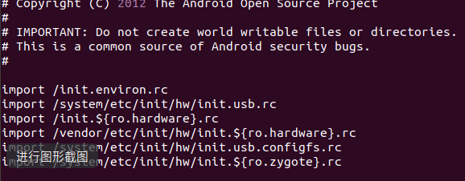
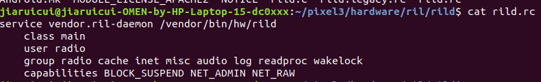
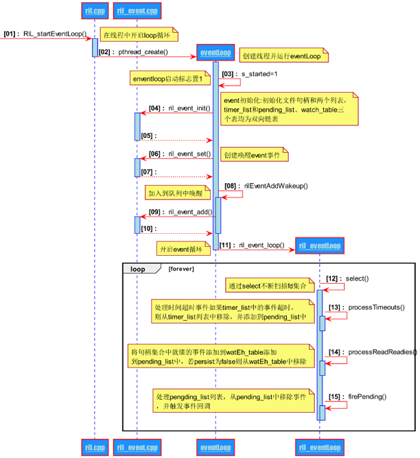
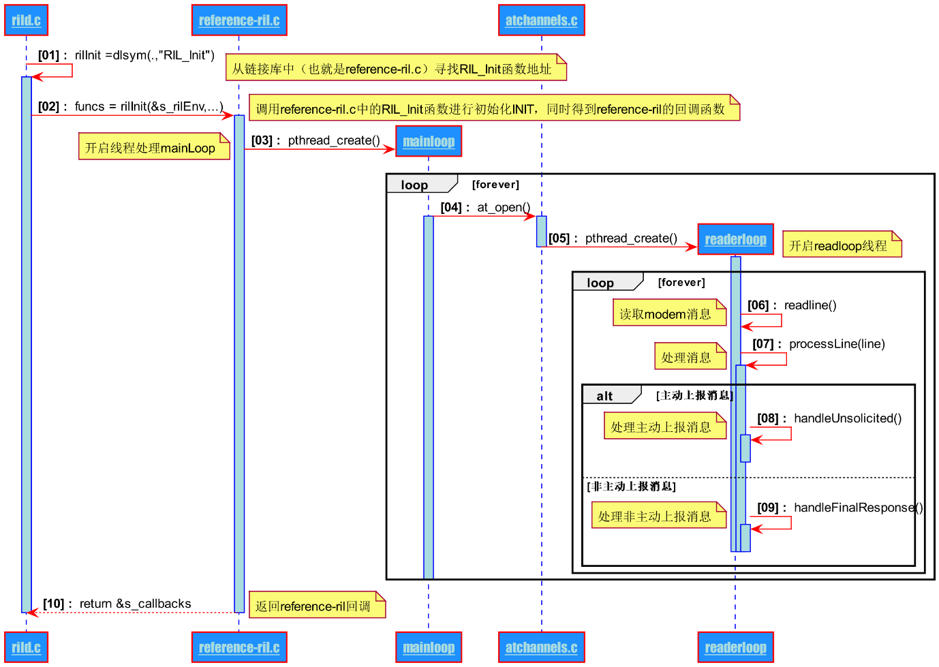
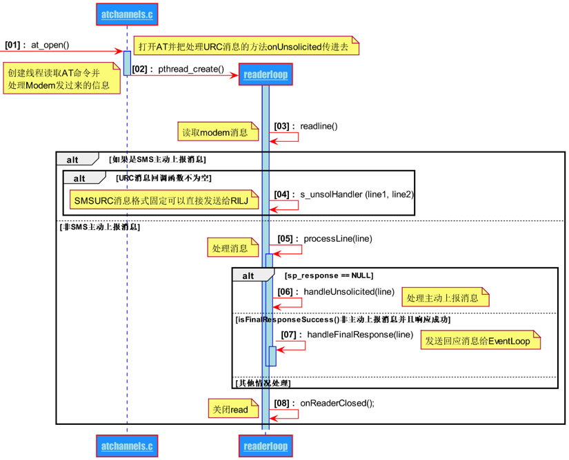
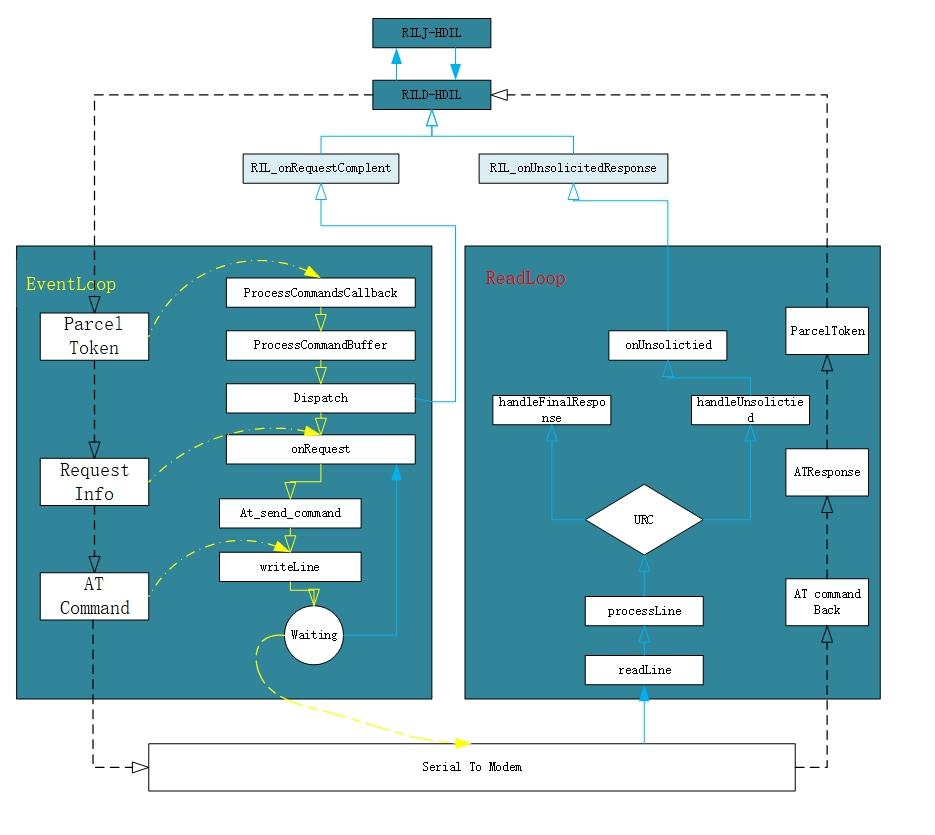

# Android RIL 介绍

## 简介
    Android 作为通用智能设备平台，其首要功能就是通话、短信、数据等通信功能。这也是移动OS与桌面windows的最大区别。本文会介绍Android Ril框架结构以及关键业务流程。其次本文源代码来自于aosp 11.0.0_r1分支。
    
    撰写本文目的也是市面上对于Telephony&RIL介绍的内容过于陈旧，以本文对目前RIL架构进行梳理，方便后续理解HIDL，其作为Android Project Treble中的重要内容对于解决Android碎片化有着十分重要的作用

## RIL框架结构
    RIL(Radio Interface Layer, 无线电通信接口层)在Android中的实现代码可以大致分为两大部分：
    
        1.Framework框架层中Java相关程序，简称RILJ
        2.HAL层中的c/c++程序，简称RILC

如图：

    RILC包括三部分RILD、Libril、Reference-ril，核心代码主要分布在rild、libril、reference-ril三个目录下。编译后会生成libril.so、libreference-ril.so动态链接库文件和rild可执行文件。
    
    RILC模块主要实现LibRIL和Reference-RIL之间的相互调用，完成RIL请求转为换成AT命令和AT命令下发到RIL的交互。

## 1.RILJ 

    TBD

## 2.RILC

### 2.1 RILC 代码目录

如图：

    按照模块分别编译，可以得到libril.so, libreference-ril.so和rild的结果文件。各自make以及其产物：

### 2.1 RILC运行机制

### 2.2 RILC启动

#### 2.2.1 RILC 加载入口

    Android手机在开机过程中，linux Kernel会运行rild可执行文件以及启动libril；在 pixel3/system/core/rootdir/init.rc配置文件中，标定了RILC启动相关的配置信息：

    在init.rc中import了 vecdor/etc/init/hw/init.$(ro.hardware).rc,which means  pixel3/hardware/ril/rild/rild.rc

   

#### 2.2.2 RILD启动

    rild加载从rild.c main函数中开始启动，启动时序图如下：

    入口函数主要完成了3个作用：
    1、开启EventLoop循环，完成RIL与RILJ层数据交互（HIDL）
    2、打开动态库reference并构建ReaderLoop循环，完成RIL与Modem层数据交互（通过AT）
    3、注册reference的回调函数。

#### 2.2.2.1 eventLoop

Event要做的就是循环检测Eventloop中添加的句柄池，如果在当前的句柄池中有任意一个句柄所代表的通道中有新的数据进来，就去处理当前的新数据

Event的搭建由两个步骤：
1、初始化链表
2、进入loop循环。

RIL的Event管理体系之中存在三个链表结构：watch_table,timer_list,pending_list,并使用了一个设备句柄池readFDS，吧所有的文件句柄保存起来。管理的过程可以归纳为以下6点：
1、可以将一个Event添加到watch_table或者timer_list中。
2、如果Event是添加到watch_table中，需要把当前Event的fd（事件设备句柄）添加到readFDS中。
3、如果Event是添加到timer_list中，不需要把当前的Event的fd（事件设备句柄）添加到readFDS中，而且当前Event的fd值是无效的；
4、在循环检测过程中，如果发现watch_table中有Event就会把前事件添加到pending_list中，如果当前Event的persist属性为false，说明不需要保留当前节点，就把当前的Event从watch_table中删除：如果persist为true，说明需要保留，就不需要从watch_table中删除当前节点。
5、在循环检测过程中，如果返现timer_list中的Event超时时，把当前Event移动到pending_list中，同时删除timer_list中的节点。
6、在循环检测的过程中，等watch_table和timer_list处理完毕后，就去pending_list中执行里面的Event所指向的回调函数。

当RILJ发送数据后，在EventLoop中会依次被timer_list、watch_table、pending_list处理.

#### 2.2.2.2 readerLoop

​    在这一步中，RIL需要加载一个AT相关的referenceril.so的动态链接库。之所以使用库的形式，就是考虑到每个厂商使用的Modem不同，我们没法用统一的接口去向底层负责，因此使用库的形式。这样一来，不同的Modem厂商提供不同的链接库，只要符合RIL层的框架即可。而当前的链接库中最主要的就是就是reference-ril.c和atchannel.c文件。    而reference库需要完成两个任务：    1、将eventLoop中的命令通过AT发送给Modem;    2、构建一个readerLoop循环，接受Modem消息，并根据消息的不同（URC和非URC）将消息返回给event侧（非URC消息）或者直接发送给RILJ（URC消息）。    我们先看readerLoop构建过程
1、在at_open之前初始化AT通道的关闭方法和超时方法（at_set_on_reader_closed(),at_set_timeout()）
2、当前线程在打开AT通道后，在waitForClose中阻塞等待，如果AT通道在检测超时后，将会主动的关闭当前的AT通道，此时将会激活waitForClose中的阻塞线程，然后waitForClose将会返回。而且一旦waitForclose函数返回，将会再次进入for循环，重新打开AT通道。

1、readerloop不断侦测Modem上报的消息，然后根据是否是URC消息来采用不同的处理方式。至于具体的判断依据，在两个地方可以体现：
     1、通过isSMSUnsolicited判断（如果以CMT/CDS/CDM开头则判断成立）  
     2、也可以在processLine中判断（这是主要的判断依据）。
          processLine判断URC消息的依据。我们知道，如果不是URC消息，那么就是我们主动发送的请求，Modem是作为回应给我们发消息，而在我们给Modem发送消息时，会注册响应市的回调函数和用于放置Modem返回数据的指针sp_respone。而如果是URC消息，那么就没有回调函数，而且sp_response为空，reference正是通过判断sp_response的内容来达到区分URC消息的目的。

### 2.3 一个完成流程

这里用一个完整的数据流来把两个loop串起来。而一个完整的数据流应该包括以下四个步骤：    1、Eventloop接收RILJ的请求，并负责把请求发送给reference库：Eventloop--->reference
     Eventloop中提到如果检测到句柄池中的某个句柄有新数据的话，就会调用将timer_list和watch_table中的Event放入pending_list中，然后调用当前Event的回调函数，这里的回调函数其实就是reference-ril.c中的onRequest,经过这次调用，就将数据由Eventloop侧传到了reference侧。
    2、reference负责把命令转化为AT命令，然后发送给Modem：reference--->Modem

reference中的onRequest对所有的命令请求进行判别，然后选择不同的处理方式。对于尝试得到SIM状态这个请求来说，不仅需要通过getCardStatus得到SIM卡状态，而且还需要调用RIL_onRequestComplete将得到的状态返回给RILJ。
    3、reference通过readerLoop得到Modem回应后把数据返回给readerloop:   Modem--->ReaderLoop
at_send_command_singleline完成了两个重要动作：
1、通过writeline发送数据到Modem；
2、阻塞当前线程，等待Modem回应。
    4、reference通过readerLoop得到Modem回应后把数据返回给RILJ
  在ReaderLoop的处理过程中，当消息处理完毕时，去唤醒另一端阻塞的线程。，同时，把Modem的回应（line）传递给sp_response。
  最后，通过RIL_onRequestComplete重新返回给libril，这个函数中有一个参数t，而这个t就是请求消息ID。当我们从RILJ发送数据时，就会把一个表示当前这个请求的的令牌传递下去，而当Modem返回数据后，我们再通过这个令牌找到当初发送的请求，然后把数据传递给他。 

